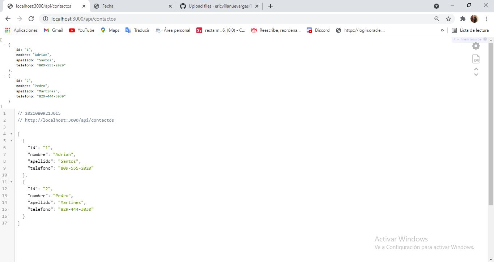
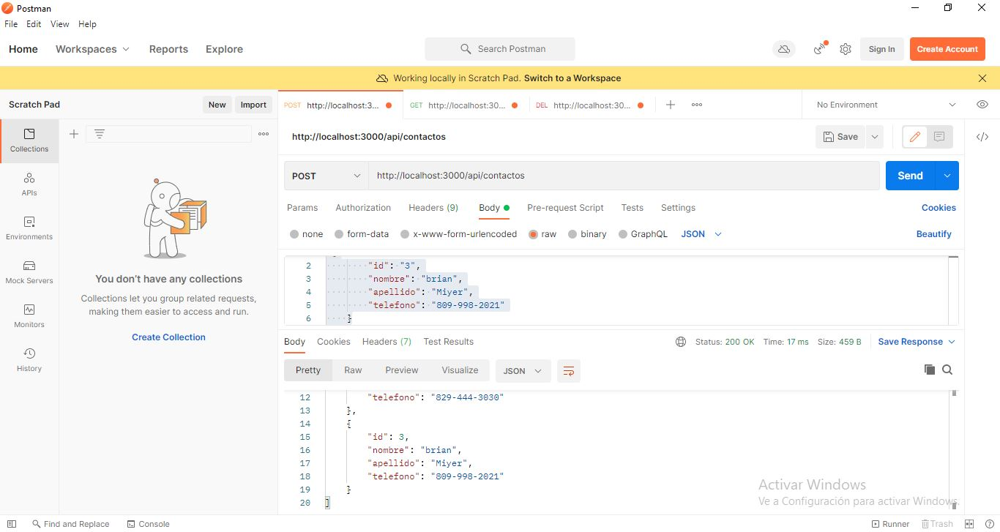
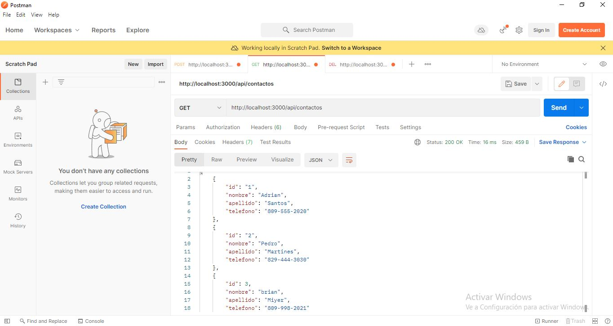
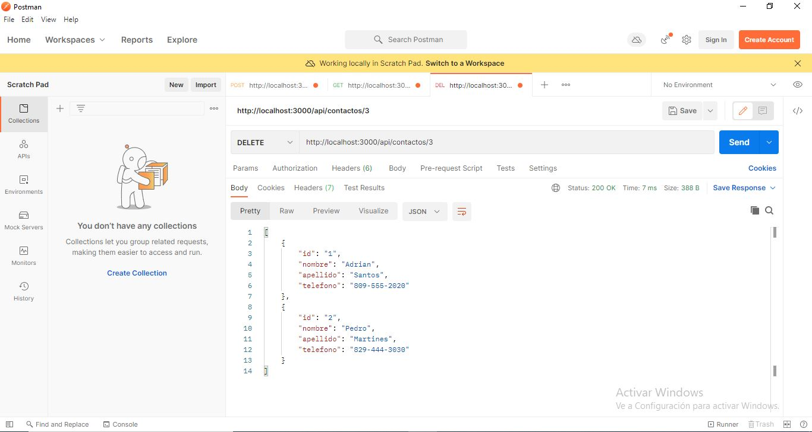

Tarea 5 Servicio Web

Esta es mi tarea 5 mi servicio web de la clase de programacion web Raydelto Hernández 

Aqui esta como se ve en el navegador:

Aqui esta en la aplicacion postman y realizo la funcion post:

Aqui esta en la aplicacion postman y realizo la funcion get:

Aqui esta en la aplicacion postman y realizo la funcion get:

